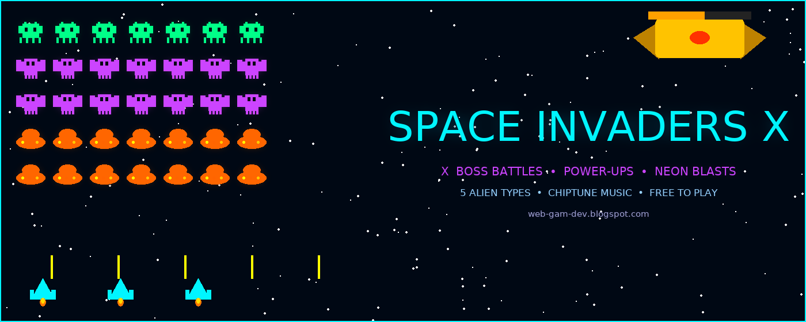

# Space-Invaders-X
Classic Space Invaders with neon blasts, power-ups &amp; boss battles every 5 levels. Defend Earth from the alien invasion!

👾 SPACE INVADERS X — The Ultimate Retro Arcade Shooter

Experience the legendary Space Invaders reimagined for the modern era with stunning neon visuals, explosive particle effects, and intense gameplay that keeps you coming back for one more run!

🔥 FEATURES:

▶ CLASSIC SPACE INVADERS GAMEPLAY EVOLVED
- 5 rows of 10 alien invaders with distinct types and behaviors
- Authentic marching formation that accelerates as aliens are eliminated
- 4 destructible bunkers to shield your ship

⚡ POWER-UP SYSTEM
- [3X] MULTI-SHOT: Fire a spread of 3 bullets simultaneously
- [SPD] SPEED BOOST: Supercharge your ship’s movement speed
- [SHD] SHIELD: Become temporarily invincible with a glowing force field
- [BOM] BOMB: Instantly obliterate ALL aliens on screen

💀 BOSS BATTLES EVERY 5 LEVELS
- Epic bosses appear every 5 levels with unique attack patterns
- Bosses fire aimed shots, spread blasts, and rain barrages
- Defeat bosses for massive bonus points and guaranteed power-up drops

🎮 ALIEN TYPES & POINTS
- Green Squids (top row): 30 points — fastest and deadliest
- Purple Crabs (middle rows): 20 points — animated claw attacks
- Orange UFOs (bottom rows): 10 points — tractor beam armed

✨ VISUAL EFFECTS
- Full neon art style with glowing outlines and particle trails
- Animated alien sprites with frame-by-frame movement
- Dynamic particle explosions for every kill
- Animated starfield background with twinkling stars
- Engine flame effects on player ship

🎵 AUTHENTIC CHIPTUNE AUDIO
- Procedurally generated chiptune background music
- Distinct sound effects for shooting, explosions, power-ups
- Satisfying boss hit and destruction sounds
- All audio synthesized via Web Audio API — no external files

📊 PROGRESSION SYSTEM
- Local high score saved between sessions
- Increasing difficulty per level (alien speed, fire rate)
- Level counter and live power-up timer displayed in HUD

⌨️ CONTROLS
- Arrow Keys / WASD: Move ship
- Space / Up Arrow: Shoot
- P: Pause/Resume
- Enter: Start / Restart

🎮 MORE FREE GAMES
Visit https://web-gam-dev.blogspot.com to discover and play all our browser games!
